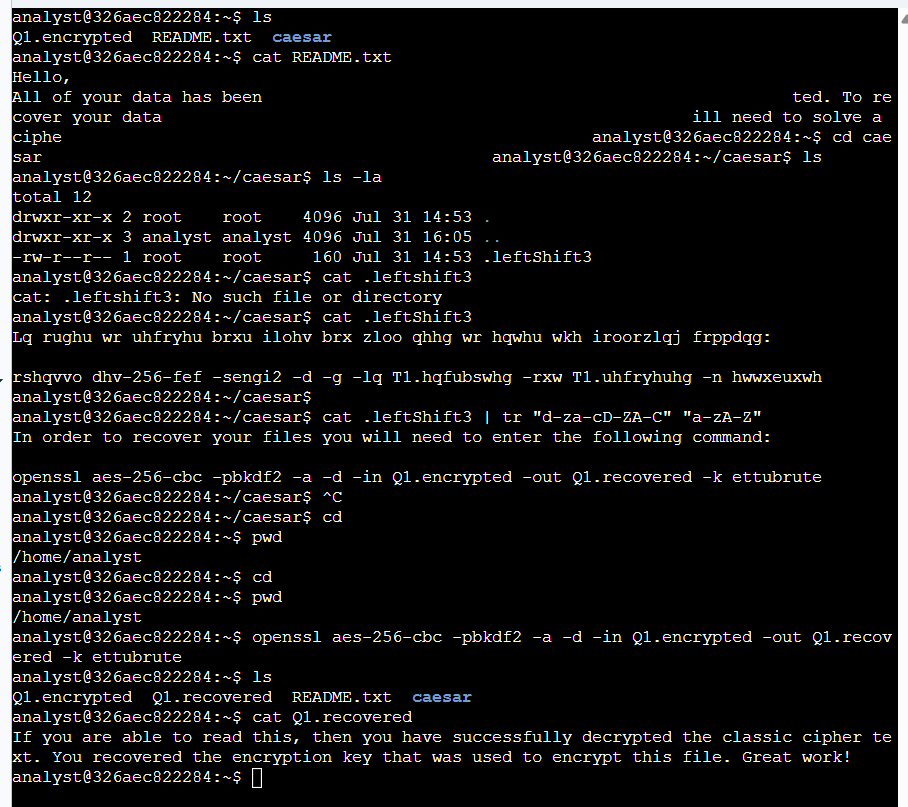

# Cryptography & OpenSSL Lab

## Overview

Hands-on Linux lab covering basic cryptography and file decryption using Caesar Cipher and OpenSSL.

## 🔧 Tools & Technologies

- Linux CLI
- Bash
- OpenSSL
- Caesar Cipher
- AES-256-CBC

## 🧪 Tasks

### 1. Caesar Cipher

Decrypted a Caesar Cipher using the `tr` command:

```bash
cat .leftShift3 | tr "d-za-cD-ZA-C" "a-zA-Z"
```

### 2. AES-256-CBC

Decrypted an encrypted file using OpenSSL:

```bash
openssl aes-256-cbc -pbkdf2 -a -d -in Q1.encrypted -out Q1.recovered -k <key>
```

## 🎯 Skills Demonstrated

- Linux command-line operations
- Symmetric encryption
- Caesar Cipher
- AES-256-CBC
- OpenSSL
- Encryption/Decryption
- Basic cryptography concepts
