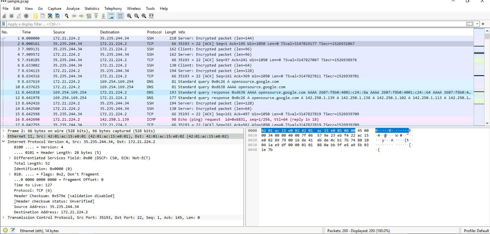
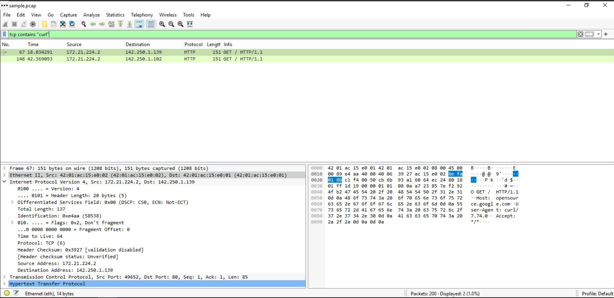
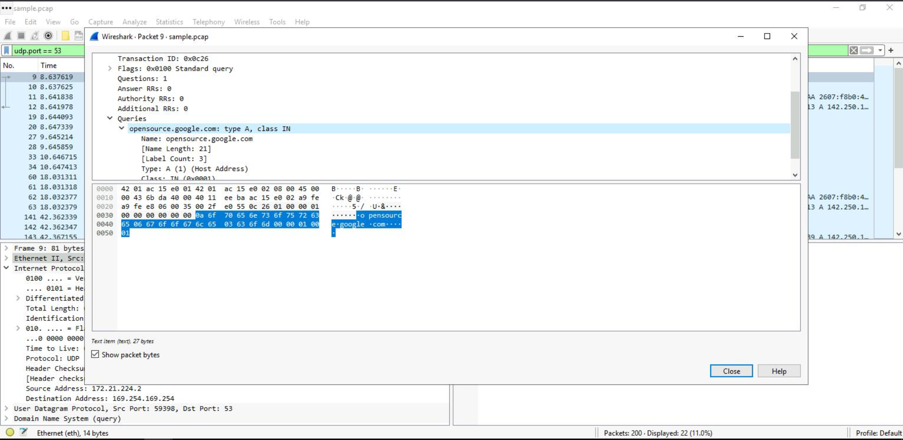
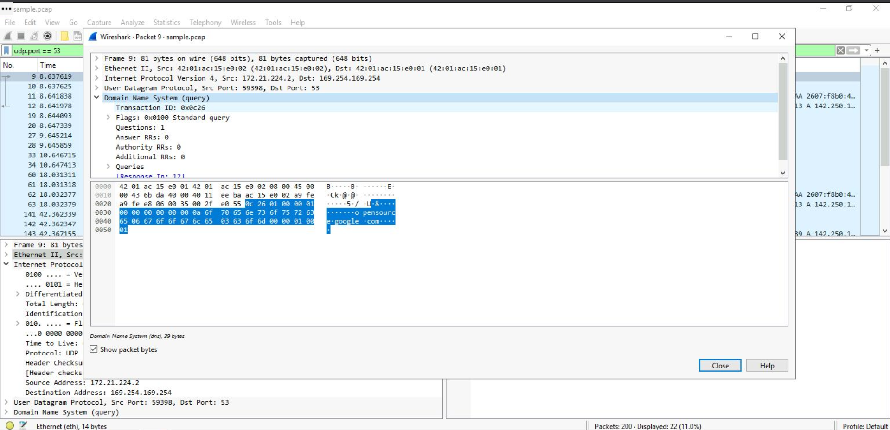
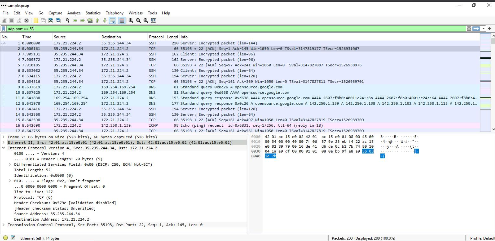
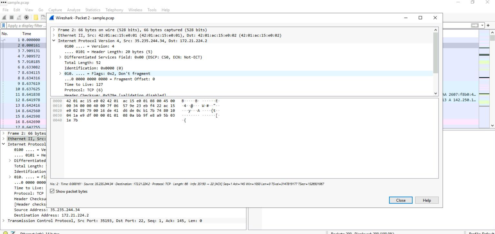

# 🔎 Wireshark Network Traffic Analysis


> Hands-on Packet Analysis & Network Investigation

## 📌 Overview

This project documents a hands-on network traffic analysis exercise using **Wireshark**.

The objective was to analyze a provided `.pcap` capture, inspect network packets and protocol layers, and use Wireshark display filters to investigate relevant traffic.

The analysis focused on **IP, TCP, DNS, HTTP, MAC addresses, and packet payloads**.

---

## 🎯 Objectives

- Analyze a `.pcap` network capture
- Identify source and destination IP addresses
- Inspect network protocol layers
- Analyze TCP communication
- Investigate DNS queries and responses
- Analyze HTTP traffic
- Use Wireshark display filters
- Inspect packet payloads

---

## 🛠️ Tools & Technologies

| Tool / Technology | Purpose |
|---|---|
| **Wireshark** | Network packet analysis |
| **PCAP** | Captured network traffic |
| **TCP/IP** | Network communication analysis |
| **DNS** | Domain resolution analysis |
| **HTTP** | Web traffic analysis |
| **TCP** | Transport-layer analysis |
| **ICMP** | Network connectivity analysis |

---

## 💻 Lab Environment

- **OS:** Windows
- **Tool:** Wireshark
- **Capture:** `sample.pcap`
- **Platform:** Google Cloud Skills Boost

---

# 🔬 Investigation



## 1. 🌐 HTTP & Payload Analysis

To identify TCP packets containing `curl`, I used:

```
tcp contains "curl"
```

The filter identified packets containing web requests generated using the `curl` command.



**🧠 Security Relevance**
Payload filtering can help analysts identify specific strings, commands, or indicators within captured network traffic.

---

## 2. 🌐 DNS Investigation

DNS traffic was isolated using:

```
udp.port == 53
```

The analysis identified the queried domain:

```
opensource.google.com
```



The corresponding DNS response included:

```
142.250.1.139
```



**🧠 Security Relevance**
DNS analysis helps analysts understand domain resolution activity and identify the infrastructure associated with a domain.

---

## 3. 🔗 IP Traffic Analysis

The following filters were used to investigate communication involving a specific host:

```
ip.addr == 142.250.1.139
ip.src == 142.250.1.139
ip.dst == 142.250.1.139
```

These filters help isolate traffic involving a specific source, destination, or both.

---

## 4. 🖧 MAC Address Analysis

Ethernet-level traffic was investigated using:

```
eth.addr == 42:01:ac:15:e0:02
```

This filter identifies packets where the specified MAC address appears as the source or destination.

---

## 5. 🔐 TCP Packet Analysis

Packets were inspected across multiple protocol layers:

```
Ethernet II
    ↓
IPv4
    ↓
TCP
```

The analysis included:

- Source and destination IPs
- TTL
- Source and destination ports
- Sequence and acknowledgment numbers
- TCP flags



---

## 6. 🌍 TCP / HTTP Traffic

HTTP traffic was isolated using:

```
tcp.port == 80
```

The packets were inspected for:

- Source and destination addresses
- TCP ports
- Packet length
- TTL
- IPv4 information
- TCP connection details

**📸 Evidence**



---

## 🔎 Important Wireshark Filters

| Filter | Purpose |
|---|---|
| `ip.addr == 142.250.1.139` | Traffic involving an IP |
| `ip.src == 142.250.1.139` | Traffic from an IP |
| `ip.dst == 142.250.1.139` | Traffic to an IP |
| `eth.addr == 42:01:ac:15:e0:02` | Traffic involving a MAC |
| `udp.port == 53` | DNS traffic |
| `tcp.port == 80` | HTTP traffic |
| `tcp contains "curl"` | TCP packets containing curl |

---

## 📊 Key Findings

- **DNS:** `opensource.google.com` was queried
- **DNS Resolution:** `142.250.1.139` was identified in the response
- **HTTP:** Traffic over TCP port 80 was observed
- **Payload:** Packets containing `curl` were identified
- **IP:** Source and destination filtering was performed
- **MAC:** Ethernet traffic was filtered using a MAC address
- **TCP:** Ports, flags, and packet metadata were inspected

---

## 🧠 Skills Demonstrated

- Network Traffic Analysis
- Packet Analysis
- Wireshark Display Filters
- TCP/IP Analysis
- DNS Investigation
- HTTP Analysis
- MAC Address Analysis
- Packet Payload Inspection

---

## 🎓 Learning Outcomes

This practical exercise strengthened my understanding of network packet analysis and its application to security investigations.

It provided hands-on experience with:

- PCAP analysis
- Network traffic filtering
- Protocol inspection
- DNS investigation
- TCP/HTTP analysis
- Packet payload inspection

These skills provide a foundation for SOC Analysis, Network Security, and Incident Response.

---

## 📚 Lab Information

- **Lab:** Activity: Analyze your first packet with Wireshark
- **Platform:** Google Cloud Skills Boost
- **Tool:** Wireshark
- **Capture:** `sample.pcap`

---

## 👨‍💻 Author

**Mahmoud Ahmed Fathy**
Computer Science Student | Aspiring SOC Analyst
Focus: Cybersecurity • SOC Analysis • Network Security • Incident Response
